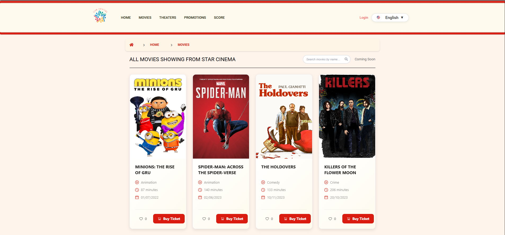
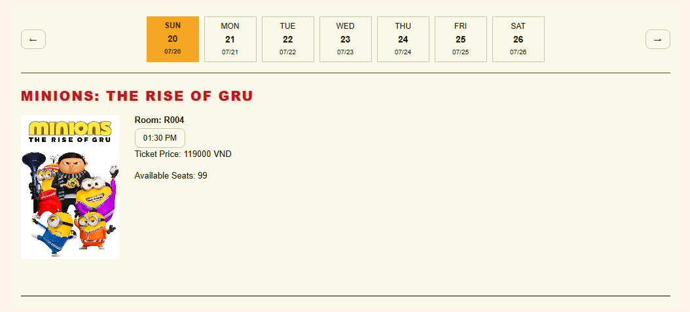
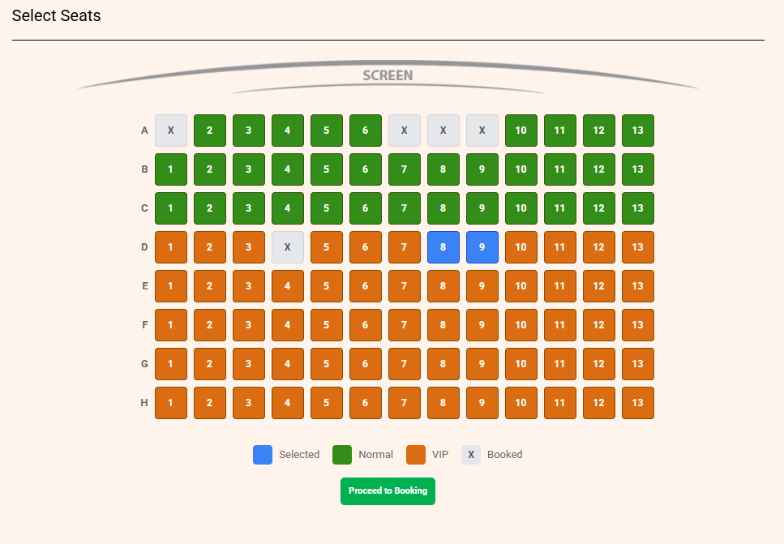
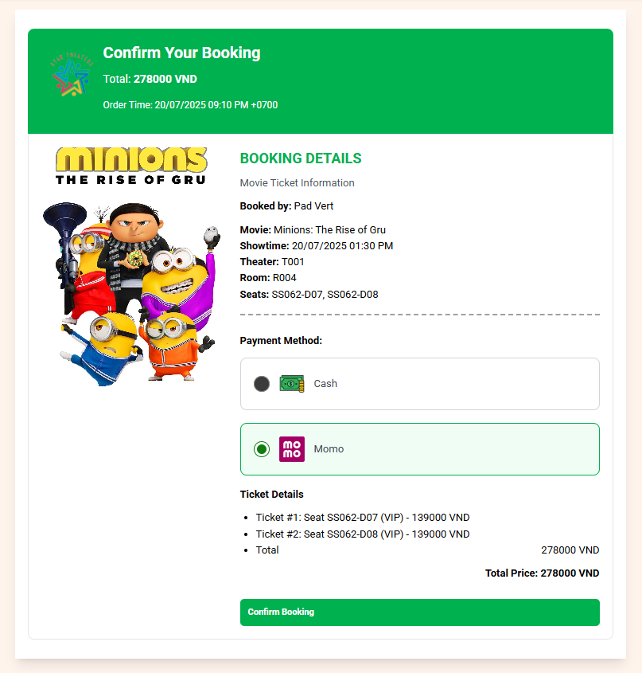

# 🌟 StarCinema – Online Movie Ticket Booking Platform



Welcome to **StarCinema** – your ultimate online destination for booking movie tickets 🎬.  
With a sleek, user-friendly interface and powerful features, StarCinema delivers a seamless experience for users to explore movies, book tickets, and enjoy cinema in just a few clicks!

---

## 🚀 Key Features

✨ **Browse & Search Movies**  
Users can explore a wide collection of movies and search by title, genre, or showtime.

🎞️ **Select Movies & Showtime**  
Choose your favorite movie and pick a convenient showtime from available options.

💺 **Choose Your Seat**  
Interactive seat map lets users pick their preferred seats – no more surprises at the theater!

💳 **Flexible Payment Options**  
Supports multiple payment methods including credit/debit cards, digital wallets, and more.

✅ **Instant Booking Confirmation**  
After payment, users receive an instant confirmation with e-ticket details.

🔍 **Smart Search Functionality**  
Easily find trending, now showing, or upcoming movies with a smart search system.

---

## 🧑‍💻 Tech Stack

- **Backend:** Java Spring Boot  
- **API Architecture:** RESTful API  
- **Database:** PostgreSQL  
- **Frontend:** React + TypeScript  
- **Package Manager:** Yarn  
- **CI/CD:** GitHub Actions  
- **Live Server:** [https://starcinema.online](https://starcinema.online)

---

## 📸 UI Preview

Below are sample screens demonstrating the core user journey from selecting showtime to completing checkout:

- 🎞️ **Select Showtime**  
  

- 💺 **Choose Your Seat**  
  

- 💳 **Checkout & Confirmation**  
  

---

## 📁 Project Structure
```bash
starcinema/
├── be/
│    └── MovieTheater/ # Spring Boot backend
├── fe/ # React frontend
├── docs/ # Documentation and resources
└── README.md
```
---

## 🛠️ How to Run the Project Locally

> Ensure you have **Java 17+**, **Yarn**, **Node.js**, and **PostgreSQL** installed.

### 📦 Backend – Spring Boot
1. Clone the repository:
 ```bash
   git clone https://github.com/yourusername/starcinema.git
 ```
2. Navigate to the backend folder:
 ```bash
   cd starcinema/be/MovieTheater
 ```
3. Set up database connection in application.properties:
 ```bash
   spring.datasource.url=jdbc:postgresql://localhost:5432/starcinema
   spring.datasource.username=your_db_user
   spring.datasource.password=your_db_password
 ```
4. Run the Spring Boot app:
 ```bash
   ./mvnw spring-boot:run
 ```
The backend should now be running at http://localhost:8080.
	
🎨 Frontend – React + TypeScript
1. Open a new terminal and navigate to the frontend:
 ```bash
cd starcinema/fe
 ```
2. Install dependencies:
 ```bash
yarn install
```
3. Start the development server:
 ```bash
yarn dev
```
The frontend should now be running at http://localhost:3000.

---

🌐 Live Demo
✅ Visit the live project here: https://starcinema.online

---

👨‍🎓 Author
Le Minh Khoa
💼 Passionate Fullstack Developer | 📍 Vietnam
🔗 My portfolio: https://minhkhoa.website

---

⭐️ Show Your Support
If you like this project, give it a ⭐ on GitHub!
Feel free to fork and contribute 🙌


